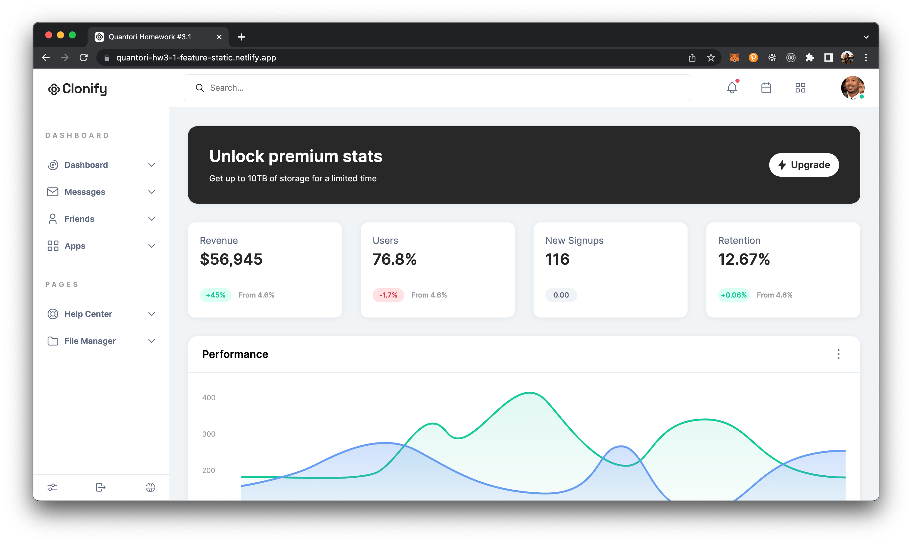
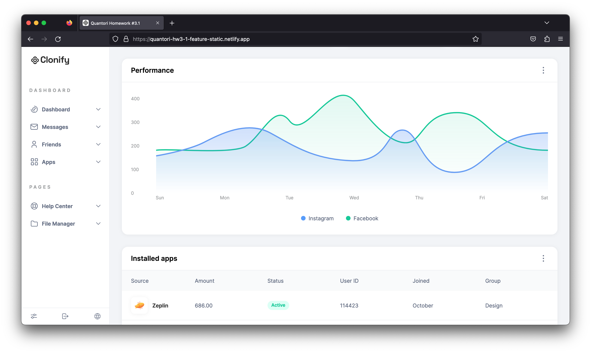
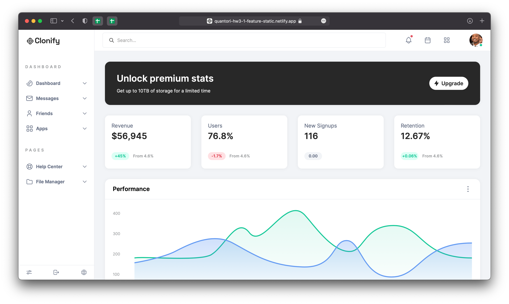
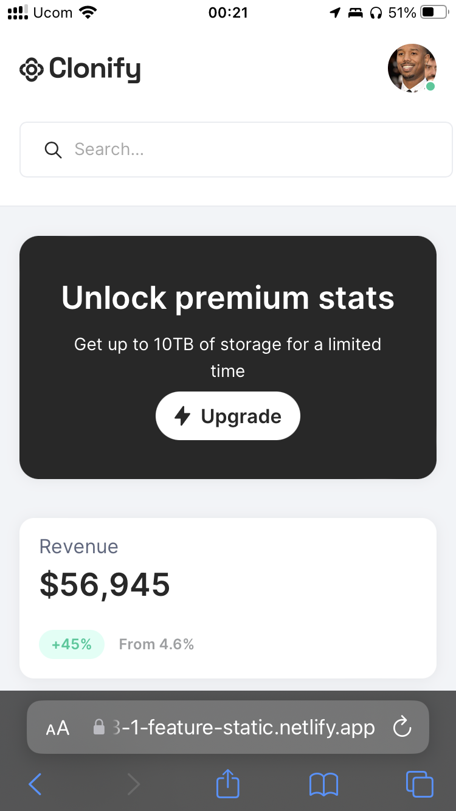
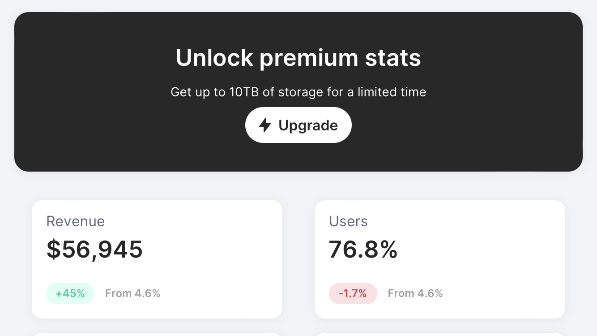
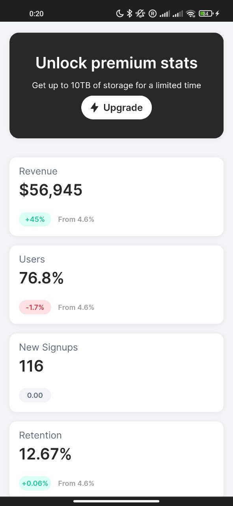
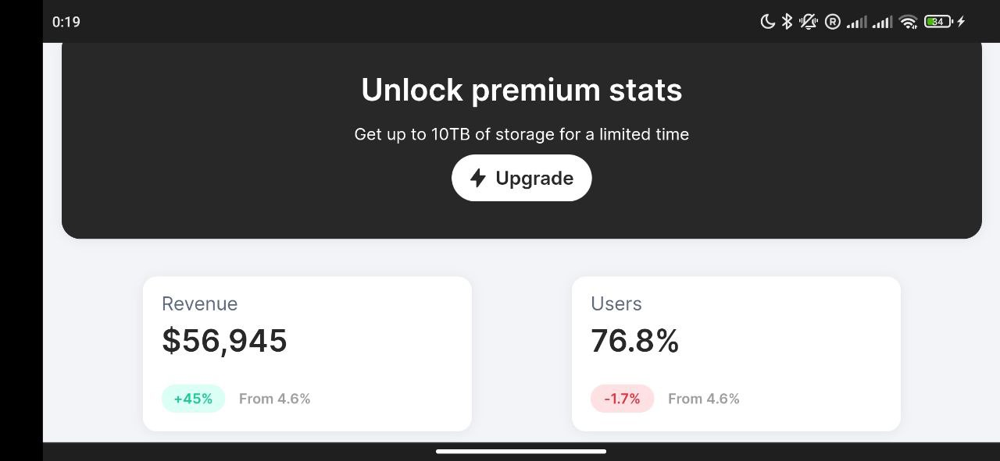

# Quantori Homework #3.1

### BEM, Graphics, Design

---

**Main Branch:** <a href="https://mordvintsevmv.github.io/quantori_homework_3_1" target="_blank">Open page</a>

**Description:** *The main branch of the app.*

---

**(Static) Responsive Layout Branch:** <a href="https://quantori-hw3-1-feature-static.netlify.app" target="_blank">Open page</a>

**Description:** *Responsive layout based on the Figma mockup.*

---

## <a name="content">Content</a>

1. [Task](#Task)
2. [Branches](#branches)
   1. [(Static) Responsive Layout Branch](#branches-static)
3. [Contacts](#contacts)

---

## <a name="Task">Task</a>

You are given a figma mockup. 
Your task is to implement the responsive layout. 
The site layout should change according to the browser viewport / screen size.  
The aim of this task is to get you working with responsive web design with a practical task and to use media queries.

---

## <a name="branches">Branches</a>

### <a name="branches-static">(Static) Responsive Layout Branch</a>

In the development *display: grid* and *display: flex* were used, which are supported by more than 96% of devices worldwide (according to the ["can i use" website](https://caniuse.com)).

The developed responsive layout was tested on a variety of devices (iOS, MacOS, Windows, Android) and browsers (Safari, Chrome, Firefox) manually.

Also, the design was tested using a [website](https://responsivedesignchecker.com) where you can explore the site at different screen resolutions.

**All checks were successful and the layout worked well on any devices.**

**Some test examples:**

**MacOS Chrome**

**MacOS Firefox**

**MacOS Safari**

**iOS Safari**

**Android Chrome**

---

## <a name="contacts">Contacts</a>

**TG**: [@mordvintsevmv](https://t.me/mordvintsevmv)

**e-mail**: mordvintsevmv@gmail.com

[🔝Content🔝](#content)
